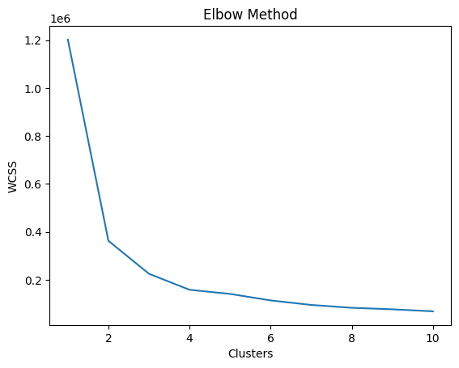
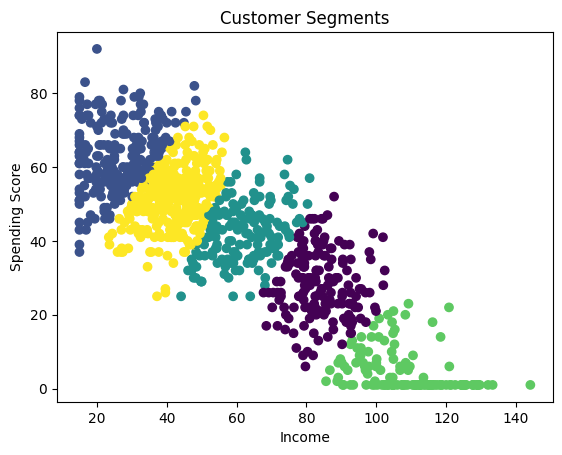

# 📊 Customer Segmentation using K-Means Clustering

---

## 🚀 Project Overview
This project uses Machine Learning (K-Means Clustering) to segment customers based on their income and spending behavior.  

The goal is to help businesses understand customer groups and improve marketing strategies.

---

## 🎯 Objective
- Segment customers based on income and spending  
- Identify high-value and target customers  
- Support data-driven decision-making  

---

## 📊 Dataset
The dataset contains:
- CustomerID  
- Gender  
- Age  
- Annual Income (k$)  
- Spending Score (1–100)  

---

## 🛠️ Tools & Technologies
- Python  
- Pandas, NumPy  
- Matplotlib, Seaborn  
- Scikit-learn  

---

## 🔄 Methodology
1. Data Cleaning  
2. Exploratory Data Analysis (EDA)  
3. Feature Selection  
4. K-Means Clustering  
5. Elbow Method (K = 5)  
6. Visualization  

---

## 📉 Elbow Method

- Used to determine optimal number of clusters  
- Optimal clusters identified: **K = 5**

---

## 📊 Customer Segments

- Customers grouped into 5 segments  
- Each color represents a different customer type  

---

## 💡 Key Insights
- High income + high spending → Premium customers  
- High income + low spending → Target customers  
- Low income + high spending → Risky segment  
- Medium income → Stable customers  

---

## 📂 Project Structure
customer-segmentation/
│── data/
│   └── Mall_Customers.csv
│
│── images/
│   ├── clusters.png
│   └── elbow.png
│
│── notebook/
│   └── customer_segmentation.ipynb
│
│── report/
│   ├── Customer_Segmentation_Analysis_Report.pdf
│   └── Customer_Segmentation_Presentation.pptx
│
│── README.md   

---

## 📄 Report & Presentation

📄 **Project Report:**  
Available in `/report/Customer_Segmentation_Analysis_Report.pdf`

📊 **Presentation (PPT):**  
Available in `/report/Customer_Segmentation_Presentation.pptx`

---

## 📌 Conclusion
This project demonstrates how machine learning can be used to identify meaningful customer segments. These insights can help businesses improve marketing strategies and customer engagement.

---

## 👨‍💻 Author
Krishna Bhise